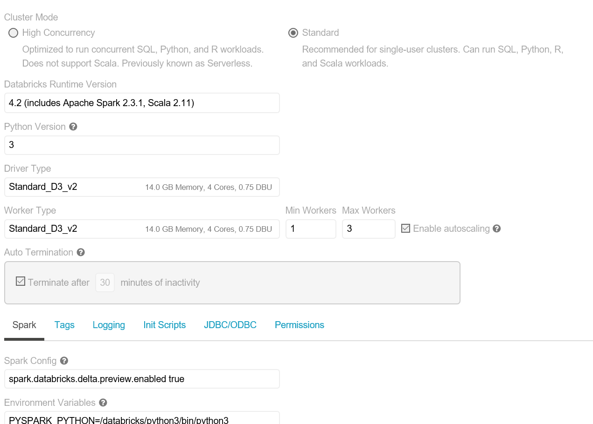

# Setting up your Azure Environment

## Configure Azure Databricks
1. Create an Azure Databricks Resource. Follow the instructions available [here](https://docs.microsoft.com/en-us/azure/azure-databricks/quickstart-create-databricks-workspace-portal).  
1. In the newly created Azure Databricks workspace. Create a databricks cluster. Please note an cluster with a max of 3 VMs using Standard_D3_v2 machines will suffice. Please note the example cluster below.  


1. Next we will need to install the Azure ML Python SDK. Create a [library](https://docs.databricks.com/user-guide/libraries.html#create-a-library) in Azure Databricks by importing the ```azureml-sdk[databricks]``` pypi library. Please note that you may need to restart you databricks cluster.  

1. Verify that the library was installed successfully by creating a notebook called "ConfigureCluster". Then paste the following code into a cell and run it.  
    ```python
    import azureml
    from azureml.core import Workspace, Run
    ```

## Configure Azure Storage Account
We will require an Azure Storage Account to read our training dataset. Please note that one can also utilize an Azure Data Lake Store for this same purpose.  

1. Create an [Azure Storage Account](https://docs.microsoft.com/en-us/azure/storage/common/storage-quickstart-create-account?tabs=portal#create-a-storage-account-1) using the Azure Portal.  

1. Create a [blob container](https://docs.microsoft.com/en-us/azure/storage/blobs/storage-quickstart-blobs-portal#create-a-container) in the Azure Storage Account you just created. 

1. In your "ConfigureCluster" Python notebook  we will want to mount the Azure Blob Container we created to your databricks cluster. Please provide the container name, account name, and account key. Please note that I usually recommend mounting an Azure Data Lake Store to your Databricks cluster to save data and machine learning models, however, for the purpose of this walk through we will use a Blob Container. 
    ```python
    container_name = ""
    account_name = ""
    account_key = ""

    dbutils.fs.mount(
    source = "wasbs://"+container_name+"@"+account_name+".blob.core.windows.net",
    mount_point = "/mnt/" + account_name + "/" + container_name,
    extra_configs = {"fs.azure.account.key."+account_name+".blob.core.windows.net": account_key})
    ```
1.  Test your connection to the blob container by running the following command in your python notebook. It should list all the files available in the container. Please note that the container may be empty at this point.    
    ```python
    dbutils.fs.ls("/mnt/" + account_name + "/" + container_name)
    ```

## Create an Azure Machine Learning Workspace
An Azure Machine Learning Workspace is the building block for training, monitoring, and deploying machine learning models in Azure using the Azure Machien Learning Service. We will create a workspace using the Azure Portal following the instructions [here](https://docs.microsoft.com/en-us/azure/machine-learning/service/quickstart-get-started#create-a-workspace).  

Please make note of your Azure Subscription Id, Resource Group Name, Azure Machine Learning Workspace Name, and Azure Machine Learning Workspace Region. 

## Get Data
1. In the "ConfigureCluster" notebook run the following command to download the mnist dataset to our cluster:
    ```python
    # download data to cluster

    urllib.request.urlretrieve('http://yann.lecun.com/exdb/mnist/train-images-idx3-ubyte.gz', filename='/tmp/train-images.gz')
    urllib.request.urlretrieve('http://yann.lecun.com/exdb/mnist/train-labels-idx1-ubyte.gz', filename='/tmp/train-labels.gz')
    urllib.request.urlretrieve('http://yann.lecun.com/exdb/mnist/t10k-images-idx3-ubyte.gz', filename='/tmp/test-images.gz')
    urllib.request.urlretrieve('http://yann.lecun.com/exdb/mnist/t10k-labels-idx1-ubyte.gz', filename='/tmp/test-labels.gz')
    ```


